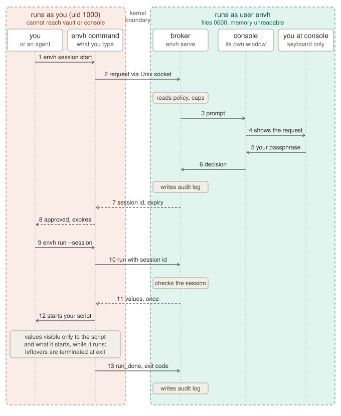

# envh

Human-approved secrets for scripts and AI coding agents, on Linux.

Your API keys stop living in `.env` files. They move into a vault owned by a separate Linux user, and every use of a key is approved by you on a console that runs as that separate user. You approve a **session** (a set of variables, for a number of minutes, with a reason); scripts and agents then run inside it. Everything is logged.

**1. You, or an agent, ask for a session** in an ordinary terminal:

```bash
envh session start weekly-report --minutes 90 --reason "forecast digest: research step"
```

**2. The envh console shows the request.** It runs in its own window, as its own user:

```
SESSION REQUEST #3   pid 51234
   reason:   "forecast digest: research step"
   preset:   weekly-report
   OPENAI_API_KEY      <- OPENAI_API_KEY
   OPENROUTER_API_KEY  <- PERSONAL_OPENROUTER_KEY
   duration: 1h (capped from 90m)
   [amber basil cedar] vault passphrase to approve #3 (hidden), or n to deny:
```

**3. You type your vault passphrase on the console** (hidden), or `n` to deny. Back in the terminal, the request returns:

```
session 3f9c... approved, expires 15:02:11
```

**4. Scripts and agents run inside the session** without asking again until it expires. Each run is logged:

```bash
envh run --session 3f9c... --reason "fetch" -- uv run python scripts/research.py
```

**Only one command, or want to approve every request?** Skip the session. `envh run` without one asks the console for that single run:

```bash
envh run --preset weekly-report --reason "fetch" -- uv run python scripts/research.py
```

## Install

Open a terminal window of its own (not a terminal inside an AI tool) and run:

```bash
git clone https://github.com/CodexVeritas/ai-env-handler.git envh && cd envh
python3 scripts/setup_wizard.py
```

The wizard walks through six short steps and asks before each change. Type `?` at any question to see what it changes, or pick "Every detail" at the start (or pass `--verbose`) to see it all along the way. Linux only.

Later, run it again to upgrade (after `git pull`) or to import more projects.

## How a request flows, and where the boundaries are



What each step means for you:

- **Steps 1 and 9 are commands you (or an agent) type in an ordinary terminal.** The `envh` command is just a client; it holds no secrets and has no special rights.
- **Steps 3 to 6 happen in a different window**: the console that `sudo envh-console` opened. It is where every approval happens, and it is the only place.
- **Steps 8 and 12 are what the client does on your side.** It prints the session id; it never prints a value. Values go straight into the environment of the script you named, and nowhere else: not into your shell, not into a file.
- **After step 13 the values are gone.** They lived only in the environment of the script and of processes it started. When the script exits, `envh run` terminates any of those processes still running (it tags the run and finds them by that tag), so nothing that received the values survives the run; the audit log records how many were stopped. Pass `--keep-background` if a run is meant to leave a daemon behind, and treat that daemon as holding the values. What envh cannot undo is a copy the script itself made, for example into a log file.

The boundaries, in words:

| Boundary | What enforces it | What it means |
|---|---|---|
| **Red box vs green box** | Linux user separation. The vault, policy files and audit log are owned by `envh` with mode 0600; the broker is a different user, non-dumpable, with no secrets in its environment. | You, your scripts, and any agent running as you cannot read a secret, a policy or the log, and cannot change what is allowed. |
| **The socket** | A Unix socket in `/run/envh`, a directory only `envh` can write. The broker reads the connecting process's uid from the kernel (`SO_PEERCRED`, not spoofable) and only talks to logins listed under `users:` in `config.yaml`. | Anyone running as a listed user can *ask*. Asking never grants anything; it only puts a prompt on the console. Other local accounts are refused before they can see or request anything. |
| **Per-user sessions** | Every session and pending request is tagged with the kernel-reported uid that created it. | A session can be used, waited on, listed or ended only by the user who opened it. Two listed users on one machine cannot use each other's sessions; only the console sees everything. |
| **The console keyboard** | `TIOCSTI` disabled in the kernel, the terminal device chowned to `envh`, approval by your vault passphrase typed hidden, next to your console phrase. | No process running as you can inject keystrokes through the terminal itself. Something that can type but cannot see your screen or record your keys cannot approve without the passphrase. A fake prompt elsewhere cannot show your console phrase. Your display and input devices are a separate way in; see the next row. |
| **Not a boundary** | | During step 12 the value is in a process running as you, like any environment variable. A session id is a bearer token for its lifetime. The reason and the pid shown in the prompt are claims by the requester. On an X11 desktop, a same-user process can record the passphrase as you type it and then type it into the console itself; see [Who else can see and type into the console](#who-else-can-see-and-type-into-the-console). |

## What it protects, and what it does not

**Kernel-enforced, against any process running as you (including every agent):**

- The vault, the policy files and the audit log are owned by the service user `envh` with mode 0600. You cannot read them; neither can an agent.
- The vault is encrypted at rest (age, passphrase mode) for the case of a stolen or copied disk.
- The broker's memory is unreadable: a different user, marked non-dumpable, with no secrets in its environment.
- Nothing can type into the console through its terminal. Linux 6.2+ disables the `TIOCSTI` ioctl (checked at start), and the console's terminal device is chowned to `envh` before the broker starts. Your display server and input devices are another way in; see [Who else can see and type into the console](#who-else-can-see-and-type-into-the-console).
- The code is root-owned under `/opt/envh`; the only client is `/usr/local/bin/envh`.

**What a key use means:** the approved command receives the real value in its environment. It is visible to that process, to everything it imports, and to every other process running as you while it runs. A malicious dependency no longer gets every key on disk whenever it likes; it gets the values of the one approved run it is part of, and you see that run in the log.

**While you are not at the console, nothing is approved or changed.** Approving a request, and `add`, `rm`, `preset rm`, `edit`, `passphrase` and the first rename in `keys` on the console, all ask for your vault passphrase, typed hidden. A wrong passphrase is logged and pauses the console for two seconds, so guessing by typing blind is slow and visible. With the console closed, the vault is encrypted with that passphrase, which is stored nowhere. The exception is a session you already approved: it keeps working until it expires.

**One passphrase, on purpose.** The vault passphrase both unlocks the vault and approves requests, so approving is one thing to type. That costs some security, and you should know what: you type the passphrase often, so on X11 a program running as you has many chances to record it; and anyone who learns it can approve at your console and also decrypt any copy of `vault.age`, such as a backup. To make a fake prompt easy to spot, every approval prompt shows your console phrase: type the passphrase only where you see it. See [Who else can see and type into the console](#who-else-can-see-and-type-into-the-console).

See [What envh does not do](#what-envh-does-not-do) before relying on it.

## Start the console

Open a **separate terminal window** (not a terminal pane inside an AI tool) and run:

```bash
sudo envh-console
```

Or click the "envh console" launcher. Enter your sudo password, check the console phrase, enter the vault passphrase. If a window asks for the passphrase without showing the console phrase, close it: something is impersonating envh. Leave this window open; it is where you approve requests. Closing it ends all sessions.

The helper chowns the terminal device to the service user for the duration and restores it afterwards.

**You don't have to watch the console.** When a request needs your passphrase, envh shows a desktop notification with its own chime, and the console rings its bell.
- **It reminds you while the request waits:** after 30 seconds, 1 minute, 2 minutes and 5 minutes, then every 5 minutes. Each reminder updates the same notification ("has been waiting 2 minutes"), and the notification disappears once you approve or deny.
- **The notification comes from the program that asked.** That program runs as you, in your desktop session, and reminds you only while it is still waiting. A request from a script with no desktop session (cron, SSH) only rings the bell.
- **The chime is envh's own**, a short rising bell, so it isn't mistaken for another app. envh generates it and keeps it in your private runtime folder (`$XDG_RUNTIME_DIR`).
- **Its text is fixed.** It never shows the requester's reason, so a request can't use it to show you instructions.
- **To turn off the notifications, the chime and the bell, set `notify: false` in `config.yaml`.** Use `edit config` on the console.

## Move your `.env` files over

```bash
envh import --dry-run ~/code            # scan a directory (depth 3) and show the plan
envh import ~/code                      # or give specific files: envh import ~/code/bot/.env
```

Import one project now and others whenever you like; an import never overwrites what is stored. Keys are named `<PROJECT>_<NAME>`, where the project is the folder that holds the `.env` (`news-bot/.env` gives `NEWS_BOT_OPENAI_API_KEY`). A key whose value is already in the vault is reused under its stored name instead of being stored twice. If a name is already taken by a different value, the new one gets a number (`NEWS_BOT_OPENAI_API_KEY_2`). The console shows the final names before you approve, and the presets and the rewritten `.env` comments use them. To rename a key later, see [See and rename your keys](#see-and-rename-your-keys); to replace a stored value, use `add NAME` on the console.

The wizard walks through six steps and writes nothing until the last one:

1. **Files.** Lists every `.env` and `.env.*` found (not `.env.example`); choose all or some.
2. **Contents.** Parses active lines and commented-out assignments, and treats comment headers as **groups**. A comment holding a long token that is not a word, such as a key, is never taken for a header, so it is not printed or built into names; it stays in the file, and `envh scan` reports it. A file like this

   ```
   GITHUB_TOKEN=...
   LOG_LEVEL=info

   # Team Mode
   OPENROUTER_API_KEY=...
   ASKNEWS_API_KEY=...

   # Personal Mode
   # OPENROUTER_API_KEY=...
   # ASKNEWS_API_KEY=...
   ```

   has a base group (`GITHUB_TOKEN`, `LOG_LEVEL`) and two mode groups. Each variable is classified as secret or config by its name and value; you can flip any.
3. **Names.** Secrets get vault names that start with the project: `NEWS_BOT_GITHUB_TOKEN`, `NEWS_BOT_TEAM_OPENROUTER_API_KEY`, `NEWS_BOT_PERSONAL_OPENROUTER_API_KEY`, and so on. Identical values share one entry, across projects and with keys already in the vault. Rename anything.
4. **Presets.** One preset per group, named `<repo>-<group>` (`news-bot-team`, `news-bot-personal`), each containing the base variables plus the group's. A repo without groups gets one preset named after it. Drop presets, then rename them, both by the names listed.
5. **Plan.** Secrets to store (names and fingerprints only), presets in full, and per file the lines that change, shown as they will read: each secret line becomes `# VAR -> envh secret NAME (presets: ...)`. The old lines are not shown, since they hold the values. Headers and config lines stay as they are. Choose per file whether to rewrite it.
6. **Apply.** The console shows the same summary and asks for your vault passphrase. Then each original file is backed up and the files are rewritten.

**The backup.** Before rewriting, the wizard copies each original file into a new folder, `~/.local/state/envh/import-backups/<date-time>/` (under `$XDG_STATE_HOME` if you set it), at its full path: `/home/you/code/bot/.env` is backed up as `.../<date-time>/home/you/code/bot/.env`. The folder is mode 0700 and the wizard prints its exact path, with the command to delete it. The copies hold the old values in plaintext, readable by anything running as you, just as the original files were. So once the rewritten files work, delete the folder (`rm -r ~/.local/state/envh/import-backups/<date-time>`). `envh scan ~` keeps reporting it until you do.

To see a value later without the backup: `envh run --with VAR=SECRET --reason "recover" -- printenv VAR`, approved on the console.

## Find leftover copies

Keys end up in more places than `.env` files: shell history, Claude Code transcripts under `~/.claude/projects`, notebooks, scratch scripts, other repos, git remotes with embedded tokens. After importing, find them:

```bash
envh scan                      # your home directory
envh scan ~/code ~/Downloads   # specific places; add --json for machine-readable output
```

It prints the file, the line, what kind of key it looks like, the first four characters, the length and a short fingerprint, never the value. The fingerprint lets you see that the same key sits in several files. Exit code 1 means something was found. While it runs, a progress bar shows how much it has read and about how long is left.

To stay fast it skips binaries, files over 25 MB (`--max-size`), and folders of installed code and caches that hold none of your keys but can hold millions of files:
- **Installed packages and environments:** `.venv`, `venv`, `node_modules`, `site-packages`, conda, uv's Pythons, pipx, `.cargo`, `go/pkg` and the like.
- **Caches:** `.cache`, app caches such as `Cache` and `GPUCache`, and any folder tagged with `CACHEDIR.TAG`. Hugging Face's token file in `.cache` is still read.
- **Build output:** Next.js's `.next`.
- **Other bulky data:** editor extensions and Claude Code plugins, Flatpak apps' own data (`~/.var/app`), browser and mail profiles, Steam, Wine and snaps.

`envh scan --help` lists every skipped folder, and the report repeats the summary. It looks inside `.git/config` but not git history.

What it can and cannot identify:

- **By value, anywhere:** OpenAI, OpenRouter, Anthropic, Perplexity, Google/Gemini, E2B, GitHub, Slack, AWS, Stripe, Hugging Face, Groq, Tavily, Replicate, Notion, SendGrid, JWTs, private keys, database URLs with passwords.
- **Only in a named assignment** (`FRED_API_KEY=...`, `serp_api_key: "..."`): SerpAPI, FRED, AskNews, Hyperbrowser, Metaculus, Exa, Mistral, Cohere, Together and other keys that are plain hex or random strings. A bare copy of one of these in a transcript has no distinctive shape and is not reported; search for it yourself with a few characters you remember, for example `grep -rl 'first8chars' ~/.claude`.
- **Not scanned:** git object history (`git log -p -S<prefix>` inside a repo), binary databases such as browser profiles and VS Code state, encrypted stores such as the Claude desktop app's local environment, and mounted drives outside the paths given.

The scan stays separate from the import wizard on purpose: the wizard moves values out of files you chose, the scan is a read-only audit of everything else. The wizard prints a reminder to run it.

## See and rename your keys

Type `keys` in the console. Arrow keys move through your keys, each shown with the presets that use it. **F2** renames the selected key: the field starts with the current name (Ctrl-U clears it), type the new name, press Enter. The first rename asks for your vault passphrase; later renames in the same visit do not. Esc goes back, and any request that arrived meanwhile is shown then. Other keys do nothing while you browse, so a passphrase typed there by mistake is dropped.

A rename follows the key everywhere envh refers to it: the vault, its policy in `config.yaml` (your comments stay), presets, live sessions and waiting requests. Two things keep the old name: the `# VAR -> envh secret NAME` comments in `.env` files you imported, and any command or script that names the key itself (`--with VAR=OLD_NAME`). A new name is refused while `config.yaml` still has a policy for it (left behind by `rm`; remove it with `edit config`), or while a live session or waiting request still uses it, since either would quietly attach to the renamed key.

Asking once per visit costs a little: until you press Esc, something that can type into the console window could rename more keys without the passphrase (see [Who else can see and type into the console](#who-else-can-see-and-type-into-the-console)). It cannot read a value that way, but by swapping two names it can change which key a name refers to, and so which value a command naming that key receives.

## Daily use

```bash
envh list                                                        # secrets (names, policy), presets, live sessions
envh manage                                                      # how to add, change or remove secrets and presets

# one command, one approval
envh run --preset news-bot-personal --reason "backfill" -- uv run python scripts/backfill.py

# several commands, one approval
envh session start news-bot-personal --minutes 120 --reason "backfill articles"
envh run --session <id> --reason "backfill" -- uv run python scripts/backfill.py
envh session end <id>
```

- `envh run` without a session asks the console for that one run and waits for your answer, then runs the command. It is the way to approve every request, and the only way to use secrets marked `per-run`, which sessions never cover.
- A session is approved once; every `envh run --session` inside it is approved instantly and logged. The session lasts the minutes you asked for, capped by each secret's `max_session` and by 24 hours.
- `export ENVH_SESSION=<id>` lets you omit `--session`. `envh session start ... --quiet` prints only the id.
- Name several presets to combine them: `envh session start news-bot forecasting-bot ...`, or `envh run --preset news-bot,forecasting-bot`. You get all their variables; per-run beats session and the shortest `max_session` wins. If two presets map the same variable to different secrets, the request is refused: leave one preset out, or pick with `--with VAR=SECRET` (listing the other variables you need too).
- `--with` narrows a run to some of the session's variables, or maps variables ad hoc: `--with OPENAI_API_KEY,OPENROUTER_API_KEY=TEAM_OPENROUTER_KEY`.
- `--reason` is optional but the console shows its absence loudly. Write what you would want to read before approving.
- A running command is never killed when its session expires; expiry only stops new approvals. When the command itself exits, any process it left running is terminated so the values do not outlive the run (`--keep-background` to opt out).
- `envh status` shows pending requests, active runs and live sessions as JSON.

Exit codes: 3 broker not running, 4 denied, 5 request error (unknown preset, variable not in session), otherwise the command's own exit code.

## Policy and presets

Both policy files are owned by the `envh` user with mode 0600. Nothing running as you, agents included, can read or write them. The only ways they change:

| File | Who can change it | How |
|---|---|---|
| `config.yaml` (defaults, per-secret policy) | you, on the console | `edit config` opens it in an editor; the result is validated and shown as a diff before it is saved. A rename in `keys` moves a key's policy to its new name |
| `presets.yaml` | you, on the console | `edit presets`, `preset rm NAME`, the import wizard, approving an agent's `envh preset propose` (shown as a diff, approved with your passphrase), or a rename in `keys` |
| the vault | you, on the console | `add`, `rm`, the import wizard, a rename in `keys` |

`envh manage` lists the console commands for these changes and says whether the console is running.

An agent can only *propose*: `envh preset validate draft.yaml` checks a draft without changing anything, `envh preset propose draft.yaml --reason "..."` puts the diff on your console. A proposal that maps a variable to a secret the agent should not have is just a diff you deny. Root can of course edit the files directly; the console `reload` command picks that up.

`config.yaml`:

```yaml
users: [alice]           # login names allowed to talk to the broker; the installer fills in yours
notify: true             # desktop notification with a sound, and the console's bell, when a request needs your passphrase
defaults:
  approval: session      # session: one approval opens a session | per-run: ask on every run, never in sessions
  max_session: 1h        # hard cap 24h
secrets:
  DATABASE_URL: { approval: per-run }
  OPENAI_API_KEY: { max_session: 8h }
```

`/var/lib/envh/presets.yaml` is written only by the broker (import wizard, proposals, console):

```yaml
presets:
  news-bot-team:
    max_session: 3h
    env:
      GITHUB_TOKEN: GITHUB_TOKEN
      OPENROUTER_API_KEY: TEAM_OPENROUTER_API_KEY
  news-bot-personal:
    env:
      GITHUB_TOKEN: { secret: GITHUB_TOKEN, approval: per-run }
      OPENROUTER_API_KEY: PERSONAL_OPENROUTER_API_KEY
```

The same variable can point at different secrets in different presets; that replaces commenting lines in and out. Unknown fields, bad durations, caps over 24h and secrets missing from the vault are rejected, never warned about.

On the console, requests appear on their own, one at a time: type the vault passphrase to approve the one on screen, or `n` to deny it; others wait their turn. When no request is waiting, the console shows an `envh>` prompt for commands: `keys` (browse and rename keys; see [See and rename your keys](#see-and-rename-your-keys)), `add SECRET` (value typed hidden), `rm SECRET`, `secrets`, `presets`, `sessions`, `runs`, `preset rm NAME`, `edit config`, `edit presets` (add an editor name to override `$VISUAL`/`$EDITOR`/nano/vi), `passphrase` (change the vault passphrase; the vault is re-encrypted), `reload`, `help`, `quit`. `add`, `rm`, `preset rm`, `edit`, `passphrase` and the first rename in `keys` ask for the vault passphrase too.

## Using it with Claude Code

The wizard's "Connect Claude Code" step does this for you, and says so when a rerun finds the copies out of date. By hand, copy the pieces under `claude/`:

- `claude/skills/envh/SKILL.md` → `~/.claude/skills/envh/SKILL.md` (or a project's `.claude/skills/envh/`). It teaches the agent to run one command directly and to start a session only for several, to always give a reason, what to do when refused, and a list of things it must never do.
- `claude/hooks/envh_ask.py` plus the hooks block from `claude/settings.snippet.json` → your `settings.json`. The hook asks in the app only when a command will make the console ask for your vault passphrase: `envh session start`, `envh preset propose`, `envh import` (not `--dry-run`) and `envh run` without a session. So you are notified exactly when the console needs you. It reads the command the way a shell does: `envh` counts after `&&`, `;`, a pipe or a newline, inside `$(...)`, backticks, `bash -c` or `eval`, behind `timeout`, `nohup`, `env` or `uv run`, and with a path prefix. `envh` in an argument, a quoted string, a comment or a heredoc body, such as a commit message, a `grep` or a README being written, is a mention and never asks. Only when the quoting can't be read at all does text that looks like one of those requests ask. The hook also denies `sudo`, `su`, `doas` or `pkexec` wherever the shell would run them, reading every argument of `bash -c`, `eval` or `ssh` and a heredoc fed to a shell as commands; a mention, such as a quoted argument or a commit message, passes. Prefer rules only? The snippet has that variant too, with the caveat that plain rules match only the start of a command.

  A hook sees only the command string. A script file, an interpreter one-liner (`python -c "subprocess.run(['envh', ...])"`) or a variable-built command can get around it, which is why nothing depends on it: a disguised session-less run still prompts on the envh console, and a disguised session start still needs your passphrase typed there. The hook is attention and a second chance to deny; the console is the boundary.
- `claude/CLAUDE.snippet.md` → three lines for a project's `CLAUDE.md`. The wizard adds them to `~/.claude/CLAUDE.md` on the first connection only; updates replace the skill and hook and leave your `CLAUDE.md` as you edited it. When it lacks any of the current lines, the wizard shows them so you can add them yourself.

Agents can draft presets: they write a YAML file, run `envh preset validate draft.yaml`, then `envh preset propose draft.yaml --reason "..."`; you see a diff on the console and decide. They cannot edit the files.

## Using it with Cursor

The wizard's "Connect Cursor" step does this for you, and says so when a rerun finds the copies out of date. Cursor uses the same skill and hook as Claude Code. By hand:

- `claude/skills/envh/SKILL.md` → `~/.cursor/skills/envh/SKILL.md` (or a project's `.cursor/skills/envh/`).
- `claude/hooks/envh_ask.py` → `~/.cursor/hooks/envh_ask.py`, plus the block from `cursor/hooks.snippet.json` → `~/.cursor/hooks.json`. The hook reads Cursor's `beforeShellExecution` format and makes the same decisions as in Claude Code. The matcher keeps Cursor from starting it for commands that mention none of `envh`, `sudo`, `su`, `doas` or `pkexec`.

What differs from Claude Code:

- **Cursor's ask is less reliable than its deny.** Cursor has been [reported](https://forum.cursor.com/t/beforeshellexecution-hook-permissions-allow-ask-ignored-allow-list-takes-precedence/144244) to skip a hook's ask for a command on its own allowlist. The deny for `sudo` holds. As with Claude Code, nothing depends on the hook: the console still asks.
- **The hook never answers "allow".** In Cursor an allow can skip Cursor's own approval of a command. For commands it has no opinion on, such as `envh list`, it prints nothing; Cursor logs that as a hook failure, which does not block the command.
- **No rules file.** Cursor keeps user rules in its settings, so there is no counterpart to the `CLAUDE.md` lines. The skill carries the same instructions.
- **Cursor also reads Claude Code's setup.** With its "Third-Party Imports" setting on (the default), Cursor loads `~/.claude/skills` and the hooks in `~/.claude/settings.json` too. It does not act on an ask from a Claude Code hook, which is why Cursor gets its own hook entry. The two skill copies are identical.

## Habits that keep this safe

- **Never type `sudo` in a terminal an agent can reach**, such as the terminal pane of the Claude desktop app. sudo caches your credential for that terminal for several minutes, and the agent could run `sudo -n <anything>` there. Run privileged commands in a separate window, and consider `sudo -k` right after (the wizard does this for you).
- Start the console in its own window. Never inside an agent's terminal pane.
- Keep `NOPASSWD` out of sudoers and stay out of the `docker` group.
- Read the whole prompt before typing the passphrase: the reason, the variables, the duration, the command line.
- Type the vault passphrase only where your console phrase is shown. If you typed it on an X11 desktop while something untrusted was running, change it with `passphrase` from a text console.
- Do not paste secrets into chats, commits, logs or command lines.
- Treat `/var/lib/envh` as secret material if you ever copy or back it up. Back up `vault.age` only to encrypted media; recovering it needs only the standard `age` tool: `age -d vault.age`.
- Approve only where nothing running as you can see or type. On X11, or with `/dev/uinput` writable by you, a desktop terminal window does not qualify; see the next section.

## Who else can see and type into the console

The console is only as safe as the screen you read it on and the keyboard you type into it. On an ordinary desktop, three things let a program running as you reach both. An agent that gets past the Claude Code or Cursor hook, or never meets it, can use them.

- **An X11 session** (`echo $XDG_SESSION_TYPE` prints `x11`). Every program running as you can read any window, record every key you type, and type into any window. It can record the vault passphrase, and your sudo password, as you enter them, and then type the passphrase into the console itself. With your sudo password it has root, and root beats envh.
- **Write access to `/dev/uinput`.** It lets a program create a virtual keyboard that types into whatever has focus: X11, Wayland and text consoles alike. Some udev rules give it to the logged-in user, for example Steam's `60-steam-input.rules`; `getfacl /dev/uinput` then shows a `user:<you>` line. To remove it, override the rule with a file of the same name in `/etc/udev/rules.d` without the uinput line, then reboot. Typing blind, it does not know the passphrase; the pause after each wrong attempt keeps it from guessing.
- **Running the console inside tmux or screen started as you.** Anything running as you can send keys to it.

What does not fix it:

- **The passphrase, on X11.** It stops anything that can type but cannot see or record, such as a virtual keyboard on Wayland or a text console. On X11, a program running as you can record it the first time you type it, and approve on its own after that. If that may have happened, change it with `passphrase` from a text console.
- **One-time codes** (backup codes, an authenticator app). A recorded code cannot be replayed. But a program that can draw over and type into your windows can show you a fake request, or change the request as you type, so your code approves its request.
- **The Claude Code or Cursor hook.** It sees only the command text, so a few lines of Python that talk to the display get past it, and so does a script file. It also covers only the agent's shell commands, not MCP servers, other agents, or a package inside a script you run.

What does:

- **Approving where nothing running as you can see or type.** That can be a text console: press Ctrl-Alt-F3, log in, run `exec sudo envh-console`, after making sure `/dev/uinput` is not writable by you. Your desktop's lock screen does not cover text consoles. It can also be another device over SSH: key-only, not reachable from the internet, and not inside a tmux or screen you own. Closing that connection closes the console and ends all sessions.
- **A Wayland session.** It stops programs reading and recording across windows, which protects your sudo password everywhere, but it does nothing about `/dev/uinput`.
- **An OS sandbox around agent commands** (Claude Code's Bash sandbox, a dev container). It protects against agents only, and only if it actually blocks the display and `/dev/uinput`: inside it, `xset q` and `test -w /dev/uinput` should both fail.

## What envh does not do

- **It does not hide a value from the command that receives it.** Values are visible to that process, everything it imports, and every other process running as you for the duration of the run. envh cannot revoke a value once delivered, cannot undo a copy the command made (a log line, a file, a cache), and a session expiring does not stop a running command. It does end the run cleanly: processes the command left behind are terminated when it exits.
- **It does not isolate an agent from your other repositories, your home directory, or the network.** That needs a container or VM around the agent; see the [Roadmap](#roadmap). On the host, your agent's own permission rules and classifier are the only control over what else it reads.
- **A session id is a bearer capability within your own account.** Anything running as you that obtains it, for example from a process environment, can use it until it expires. Keep sessions short and specific. Other local accounts cannot use it: the broker checks the kernel-reported uid of every connection against the session's owner.
- **Reasons and provenance are claims.** The `--reason` text and the pid and command line shown in prompts come from the requester and help you decide; they are not verified.
- **The console is only as trusted as your display and terminal.** On X11, same-user processes can record the passphrase and type it into the console; see [Who else can see and type into the console](#who-else-can-see-and-type-into-the-console). The desktop launcher can be shadowed by a file in `~/.local/share/applications`; the console phrase makes an impostor recognizable, it does not prevent one.
- **It does not stop a persistent same-user attacker from phishing you later.** An agent that can edit your shell startup files or desktop configuration could capture the sudo password or vault passphrase at the next start. Claude Code's protected-path rules reduce this; only running agents in a container removes it.
- **It does not change your sudo settings.** sudo keeps remembering your password for several minutes in the terminal you typed it in, and anything running there can use it. Run the wizard and `sudo envh-console` in windows no agent can type into; the wizard runs `sudo -k` when it is done.
- **The vault is only as strong as the passphrase**, which also approves requests. Copies of `vault.age` or `audit.jsonl` outside `/var/lib/envh` must be treated as secrets. The audit log holds command lines and reasons, never values.
- **The import wizard leaves a plaintext backup until you delete it.** It copies each original file to `~/.local/state/envh/import-backups/<date-time>/` before rewriting it in place, and prints that path. Until you remove the folder, the old values are exactly as exposed as they were in the original files.
- **Requirements it will refuse without:** Linux 6.2+ with `legacy_tiocsti=0`, Yama ptrace scope 1 or more, sudo with a password, and your user outside root-granting groups.
- **Not provided:** rotating or revoking keys at the provider, per-request network allow-lists, rate limits, remote use, macOS or Windows support, protection against root or physical access while the broker is running. Several local users can be listed in `users:` and each gets their own sessions, but they share one vault, one policy and one console.

## Roadmap

- **Phone approval, like a Duo push.** The broker sends each request's details to your phone and you approve there; only a reply signed by a key that never leaves the phone counts. The screen you read and the button you press are then off the computer, which closes the attacks in [Who else can see and type into the console](#who-else-can-see-and-type-into-the-console) without a text console.
- **An OS sandbox for agents.** Run each agent in a dev container or VM, or a checked configuration of Claude Code's Bash sandbox. The agent then cannot reach your display, `/dev/uinput`, your home directory, or more of the network than it needs, and envh's socket is its way to ask for keys. This also isolates agents from your other repositories, which envh does not do today.

## Reporting a vulnerability

Please report privately, not in a public issue. See [SECURITY.md](SECURITY.md).

## What the install changes, upgrading, uninstalling

The wizard's install step asks for sudo once, and runs `sudo -k` afterwards so the terminal forgets it. If root has no `uv` of its own, the wizard first offers to install one into `/usr/local/bin` with astral.sh's installer (a `uv` in your home folder could be swapped by anything running as you before root runs it); you can use your own instead, at that risk.

As root, it copies the source files from your clone to a root-only folder and checks the system there. It stops where a process running as you could become root: it needs Linux 6.2 or newer with Yama, `sudo` that asks for a password (no `NOPASSWD` rules for you), and your user outside root-granting groups such as `docker`. Each problem says how to fix it; you can continue anyway after checking each one yourself. It warns on X11. `envh install` runs the same checks again, so running it directly also refuses on a problem unless you pass `--ignore-preflight` (which then says how many it ignored). Run it with `sudo` from your own account: from a plain root shell it cannot tell whose account to check, so it refuses.

Then it builds `/opt/envh` from that copy: Python 3.12 in `/opt/envh/python`, envh in `/opt/envh/env`, and the commit it came from in `/opt/envh/installed-from`. It links `/usr/local/bin/envh` and runs `envh install` (`sudo envh install --dry-run` lists its changes), which:

1. creates the service user `envh` with home `/var/lib/envh` (mode 0700);
2. installs `/usr/local/sbin/envh-console`, the root helper that starts the broker;
3. installs a desktop launcher named "envh console" if a desktop terminal is found;
4. creates the vault and the policy in `/var/lib/envh`, owned by `envh`: it writes `users: [<your login>]` into the policy, you choose the **vault passphrase** (stored nowhere; you type it to start the console and to approve requests), and you get a **console phrase**.

Nothing else on your system changes: no sudo, shell or desktop settings.

The wizard refuses to run inside Claude Code, but it cannot tell when another AI tool shares its terminal. Run it in a terminal window of its own: while the install runs, a sudo password typed there is usable from that terminal.

envh never runs from your clone. Your agents can edit the clone, and the console runs the code that holds your keys, so that code must live where only root can change it.

**Upgrade:** `git pull` in your clone and run the wizard again. It asks before updating (`?` shows the installed commit next to the clone's), and asks again if the clone has uncommitted changes, since root installs those too. The vault, its passphrase and the policy are kept. Restart the console afterwards: the running broker keeps the old code until then. The last two steps then compare the skill and hook copies for Claude Code and Cursor with the clone, and say if they are out of date. Copies you made by hand somewhere else, such as in a project, you update yourself.

**Uninstall:** `sudo envh uninstall` keeps the vault; `sudo envh uninstall --purge` deletes it too.

## Development

```bash
uv sync --all-groups
uv run pytest -q                       # no root, no network, no environment variables needed
uv run envh --help
```

Run a development broker as yourself, without installing: `uv run envh init --data-dir /tmp/envh-dev`, then in a terminal `uv run envh serve --data-dir /tmp/envh-dev --socket /tmp/envh-dev/ctl.sock`, and point clients at it with `--socket /tmp/envh-dev/ctl.sock` or `ENVH_SOCKET=/tmp/envh-dev/ctl.sock`. This gives none of the user-separation guarantees; it is for working on envh itself.

Layout, in review order. The directory tree states the trust boundaries and a test (`tests/test_boundaries.py`) keeps the imports inside them:

| Package | Side of the boundary | Contents |
|---|---|---|
| `src/envh/core/` | trusted logic, no sockets or terminals | `config.py` policy files, `durations.py`, `vault.py` (age encryption), `state.py` (requests, sessions, runs), `broker.py` (decisions and their side effects), `audit.py` |
| `src/envh/server/` | the trusted process, runs as user `envh` | `control.py` (Unix-socket protocol, peer uid), `console.py` (prompts, admin commands), `keys_view.py` (the `keys` screen), `hardening.py`, `serve.py` (startup), `init_cmd.py` |
| `src/envh/client/` | the untrusted side, runs as you or an agent, standard library only | `transport.py` (socket client), `commands.py` (`envh run`, `session`, `list`, …) |
| `src/envh/tools/` | set-aside utilities, standard library only | `importer.py` (the `.env` wizard), `scanner.py` (`envh scan`); deleting the package removes two subcommands and nothing else |
| `src/envh/install/` | root-only system setup | `command.py` (`envh install` / `uninstall`, the console helper and launcher) |
| `src/envh/platform.py`, `common.py`, `cli.py` | shared | OS facts (uid, socket path, prctl, preflight), the value fingerprint, command dispatch |

The security argument lives in `core/` and `server/`, about 1,200 lines; the rest cannot touch a secret except through the socket like any other client.
